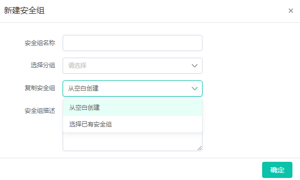
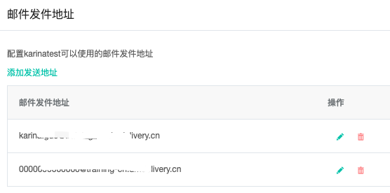
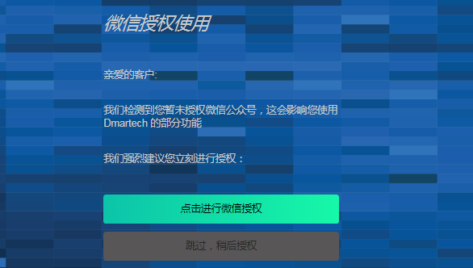

# 企业设置

依次点击平台右上角“账户名称”-“企业设置”进入企业设置操作界面。

可以看企业设置部分有多个子功能模块，包括组织成员、权限管理、数据共享、发送通道、系统设置、微信公众号。

## 组织成员\(企业版客户专享\)

组织成员用于设置企业组织架构以及各部门的成员子账号。左侧为组织架构部门树，“新建部门”建立部门架构，多层级设置部门，点击右上角“新建成员账号”，可创建成员账号。

#### 创建成员账号

 创建成员账号时，需要设置子账号所在部门和安全组，因此需要先在“权限管理“设置安全组，详细内容见下文“权限管理“部分。创建成员账号的内容有：

【账号基本信息】邮箱自行填写，密码由系统生成随机密码发送至账号邮箱；

【成员信息】成员名称、工号、姓氏、名字

【时区】用于成员账号下发送任务的默认时区设置

【账号状态】启用和停用账号

【部门】选择成员账号所属部门

【安全组】选择成员账号所属安全组，安全组相当于多个成员账号组成的组，同一个安全组的账号拥有相同的权限（关于安全组更多内容查看下文“权限管理“部分）选择安全组相当于选择账号权限

【模块许可】设置对成员账号开放哪些功能，按照系统模块划分，勾选的模块成员账号可用，未勾选的模块不可用

_**注：主账号下成员账号最多可创建80个。**_

## 权限管理\(企业版客户专享\)

权限管理基于安全组，安全组是成员账号的分组，给安全组设置的权限相当于安全组内所有成员账号的权限。

点击“权限管理“进入权限管理页面，左侧是安全组分组（安全组可分组管理），右侧是安全组列表，点击右上角“新建安全组“可创建安全组。

首先创建安全组基本信息：名称、分组、复制安全组、描述等。 其中,复制安全组：可直接选择已创建好的安全组进行复制

基本信息创建后，便可为安全组配置权限，包括三类权限分别是操作权限、管理权限、数据权限

### **操作权限**

指安全组内成员账号可访问的页面和页面内可执行的操作。勾选代表赋予权限，不勾选代表不赋予权限。

### 管理权限

管理权限指配置下成员账号在“企业设置“中的操作权限。同样，勾选则代表允许操作。

勾选管理权限，配置安全组关于“企业设置”模块内的功能权限，不勾选代表无法查看相关页面、无法执行相关功能。

### 数据权限

数据权限用于配制安全组内成员账号可见的数据范围。针对联系人、联系人分群、数据源、联系人记录、素材、表单、营销旅程、标签、表单统计、高级分群这些数据对象设置可见范围。

a\)全组织数据：所有成员账号内的数据 

b\)本人数据：仅此账号的数据 

c\)本部门数据：组织架构中与账号在同一层级内的数据 

d\)下级部门数据：组织架构中账号所在层级的下一层级内的数据 

e\)共享数据：由其他账号共享的数据

### 字段权限

字段是指元数据-用户属性内的所有用户属性字段，字段权限用于配置安全组可查看的联系人字段范围

可设置各字段“显示“或“隐藏“，隐藏分为：完全隐藏和部分隐藏。

* 完全隐藏：安全组内子账号该字段不可见。
* 部分隐藏：安全组内子账号该字段值可见部分，不可见部分使用\*\*\*\*代替。

## 数据共享（企业版客户专享）

数据共享是将本账号内的数据共享给其他安全组，包括联系人共享和资源共享。

### 联系人共享

通过创建共享规则将满足规则的联系人共享给其他安全组。

点击页面右上角“添加共享规则”创建共享规则

a）规则名称：所创建规则的名称 

b）共享数据：通过设置联系人属性条件筛选出所要共享的数据 

c）安全组：选择要将数据共享给哪个安全组 

_**注：规则名称后开关代表是否启用该共享规则**_

### 资源共享

资源指联系人及联系人分群、素材、表单、旅程、标签、表单统计记录，可以将指定部门/安全组的素材共享给其他安全组。

在“资源共享“页面，点击“添加共享规则“创建共享

a）规则名称：所创建规则的名称 （开关控制规则是否启用）

b）共享资源：通过条件筛选出安全组或者部门，即共享该部门或安全组内的数据资源

c）共享给：选择要将数据共享给哪个安全组。即安全组内成员可见“共享资源“内安全组或部门的数据

d）配置允许访问共享资源的安全组及相关操作权限

_**注：素材和表单内“共享邮件“和“共享表单“操作不可选**_

## 发送通道\(企业版客户专享\)

配置组织架构下不同部门的邮件、短信、彩信发送通道。

**【邮件发件地址配置】**

点击邮件发件地址列中的“配置“可设置该部门可用的邮件地址

点击“添加发送地址”可添加发件地址和发件人，一个发件地址可添加多个发件人“，点击“添加发件人“进行添加。该部门下子账号发送邮件时，可选择该部门下配置的邮件发件地址和发件人。

**注：每个部门可配置发件人最多20个**

**【短信发送通道配置】**

同样的，在短信发送通道列下点击“配置“可设置当前部门的短信通道

**【彩信发送通道配置】**

同样的，在**彩信**发送通道列下点击“配置“可设置当前部门的彩信通道

## 发送频次（企业版客户专享）

发送频次用于限制运行周期内单个联系人发送消息的最大次数，避免发送过频繁给联系人造成骚扰。

**运行模式有两种：全局模式和条件模式**

### **全局模式**

**全部联系人使用同一种频次限制配置**

 a）运行周期：即发送频次限制的周期，比如每天、每周、每月，也可自定义周期，表示在指定的周期内受发送频次的限制，在下一周期重新计算发送次数

b）发送上限：邮件、短信、彩信、微信客服消息、微信模板消息分别限制的发送频次，按照次/人或者不限来划分 ，比如每周限制邮件发送2次/人

c）当发送某一类型的消息给单个联系人的次数达到限制时的处理

* 不再向其发送该类型的消息，但仍可以发送未达限制类型的消息
* 不再向其发送所有类型的消息

### **条件模式**

**设置条件规则，满足规则的联系人受相应的频次设置，最多可设置15条规则，不满足任一规则的联系人将不受频次限制**

**注：只能基于一个字段设置规则**

a\)“条件字段”，仅选中“条件模式”才会出现此项。“条件模式”是针对不同类型联系人配置不同的规则，若设置“国家=中国”每天仅发送一封邮件，又设置了“年龄=23”每周仅发送一封邮件，当“国家=中国”与“年龄=23”的联系人有重叠时，此联系人应该使用哪种规则呢？**所以必须有一个条件做为通用条件类型**，此时联系人不会出现重叠的情况。

_**注：“条件字段”选中，且添加了规则后，若要更改“条件字段”，必须将已配置的规则全部删除才可更换。**_

【新建规则】

b\)设置条件字段后，按照“设置字段“等于“指定值“设置规则，比如条件字段为“所在地“，设置规则等于“北京“、“上海“，然后设置发送限制，那么所在地等于“北京“、“上海“的联系人将会受该规则的发送限制

## 系统设置（企业版客户专享）

系统设置包括旅程审批流程和两步验证的开启与关闭。

**【旅程审批】**

当开启旅程审批，所有的旅程可以申请审批，由审批人处理申请。此按钮关闭时，旅程中将看不到审批相关功能按钮。

**【两步验证】**

两步验证开启后，登录Dmartech平台使用邮箱密码登录后，还需要使用已绑定的手机号接收验证码，两个步骤都成功验证后方可登录。

_**注：绑定的手机号可在“个人设置“内配置与修改**_

## 微信公众号

管理绑定的微信公众号，若未绑定公众号，点击右上角“绑定公众号”进行微信授权，在微信后台绑定你的微信公众号。

绑定后公众号信息显示在页面上。

如需更改已绑定的公众号，请在微信后台解绑当前公众号后重新绑定。  

## 开放平台

Dmartech提供开放平台，客户可使用已分配的Key和Secret来调取DMT已提供的开放接口。

调取方式可通过【API认证信息】后的“查看API说明”来了解，接口类型和限制可通过“查看API文档”来了解。

不同接口调取的频次限制不同，可点击【API调取统计】中【可用接口数/接口总数】来查看，若要增加频次数据，请单独联系售后或客户经理。

注意：调取接口前，必须添加可用的IP和域名，否则会调取失败。

数据在接口传输中，可在【字段脱敏】内配置是否明文传输，若明文，则选中“不脱敏”，若要加密传输，则使用“脱敏”中的完全脱敏或者部分脱敏。

* 完全脱敏：字段值都将使用6个\*代替。
* 部分脱敏：字段值的后1/2用6个\*代替

