# Contents Creation and Management — Mail/ SMS/ MMS

Dmartech's multi-channel marketing is based on WeChat, email, SMS and MMS. You can view the list of email, SMS and MMS content by clicking **Marketing &gt; Contents**. All contents can be directly added and sent in the automation journey.

## Create an email

Choose **Marketing &gt; Contents** from the main menu. Contents can be managed in groups. There is a built-in group named default group in Dmartech. 

Click "+"next to **All grouping** to create a new group by yourself: enter Group Name, select the superior group \(All grouping by default\). You can create up to 4 levels of groups under All grouping. The new content will be created in default group if no group is added. 

Generally, it is recommended to set groups according to marketing scene or creator or department since it is easy to find contents and manage them. Each group can be included with any type of contents, such as email, SMS and MMS. 

## Email Header/Footer Template 

Dmartech supports the creation of email header/footer templates in order to reduce repetitive work and speed up efficiency. These templates are saved in the template library. You can directly insert the email headers and footers no matter how the email is created. In the contents list page, click email header & footer template to enter the template library. You can create header/footer templates here by pasting code or importing zip. For details, please refer to Meta.

### Create an Email by layout editor

* Method 1: Create an entire Email manually 

**Step1** Choose **Marketing &gt; Contents** from the main menu. Click the **Email** tab. Click"Add content"

**Step 2** Select which group will the email belong to in **folder** field. Then click Layout editor in create method.

**Step 3** In the layout editor page, enter **content name**. Then set each value of mandatory fields form drop-down lists: **Program, Content, Campaign** and **Language**. **Content tag** is an optional field and it can be set with multiple values.

**Step 4** Start to design the email content. In the editor page, the left side is the display area and the right side is the edit area. Click the **Settings** tab to set the global parameters of the email.

* **Width**: It is 600px by default. The recommended value for the width is within 1200px.
* **Background**: If you need a solid color background, directly click the input box to enter the color code or select the color.

Enable the Background image switch to use a background image. You can select an image in the current gallery by clicking Image gallery, or upload a local/network image by clicking  “upload“ in the Image gallery explorer.

Select the image, then set **Size, Position, Repeat and Alternate color** of the background.

* **Font:** Drop down to select the global default font, or you can set it separately in each part of the text. 
* **Image margin**: Enable the uniform setting switch to set the margin of all images in the whole email.

* **Email header & email footer**: Select the template of the email header and footer from drop-down list. Click to insert a new email header/footer template.

**Step 5**：After the global settings are completed, you can start dragging the blocks. Click the Rows tab to drag a block into the edit area. Click the block and the properties of the block can be set on the right area.

* **Block proportion**: You can set the proportion of each column of the multi-column block. The default proportion is evenly distributed. 
* **Width**: The overall block width can be set here, and it supports adaptive. 
* **Background**: Can be set with background image or solid color background. 
* **Border**: Set color, width and style for the border line. Click on the four borders in the figure to add/ cancal the borders at the corresponding positions.

* Padding: Set the paddings between the content and the block border. 
* Margins: Set the margins of the block between the block and other blocks. 

**Step 6：**After the block settings are completed, you can place content into blocks. Click the Content tab to select a content element. Drag a content element to the block on the edit area. As the figure shows below, drag the Text element to the block, and then you can edit the text content on the right after clicking the text in the display area.

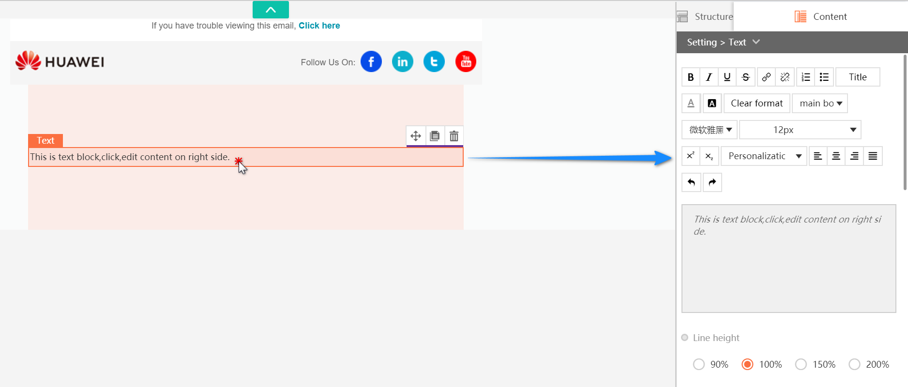

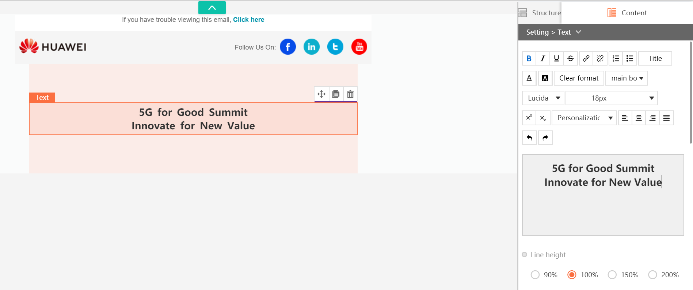

**Note**

_1.Click to add a hyperlink for the text. You can insert an internet link or a plugin link such as subscribe, unsubscribe or weblink. The Title of the links can be used in the email report to view each link clicks. It is supported to upload a calendar attachment with ics suffix by clicking“browse server"_

_2.As the figure shows above, you can insert custom fields in the email._

* Parameter Description of Image Content 
* Set an image: Upload from local computer or use the URL to load a website image.
* Image size: Support custom width, height or use self-adaptive width. 
* Image url: The hyperlink of the image. 
* Image alignment: left, center, right. 
* Image title: The text that will be displayed when the mouse hover on the image. 
* Image alt 
* Margins: Set the margins of the image between the image and other contents.

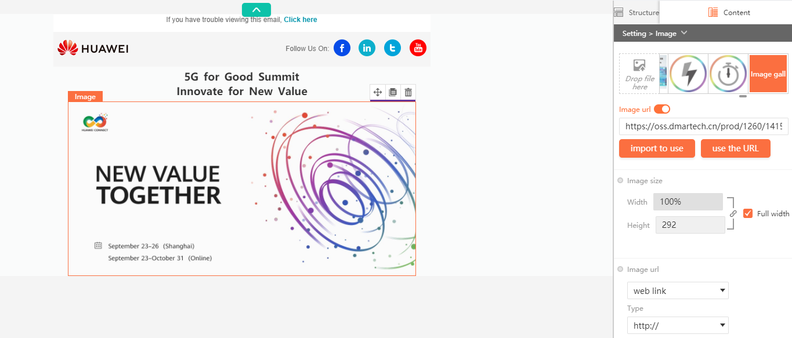

* Parameter Description of Image card Content Graphic settings need to set the Style first. 
* Text position: The layout of the image and the text. 
* Text width ratio: The ratio of the text and the image. 
* Line height: Text line spacing. 
* pacing: Text spacing. 
* Padding: The paddings between the content and the block border. 
* Image setting: Same as Image content setting.

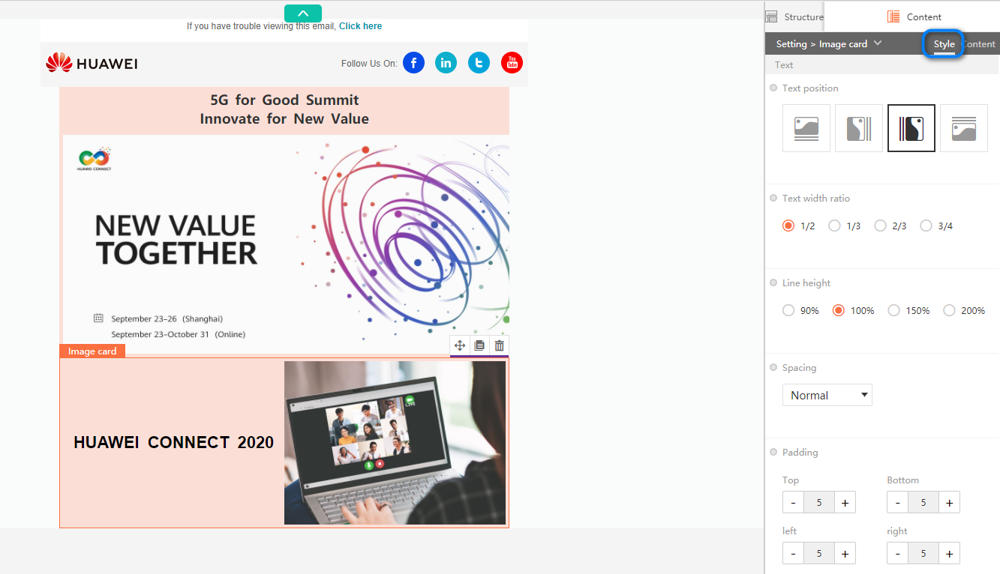

Set the Content after setting the Style, that is, set an image and edit the text.

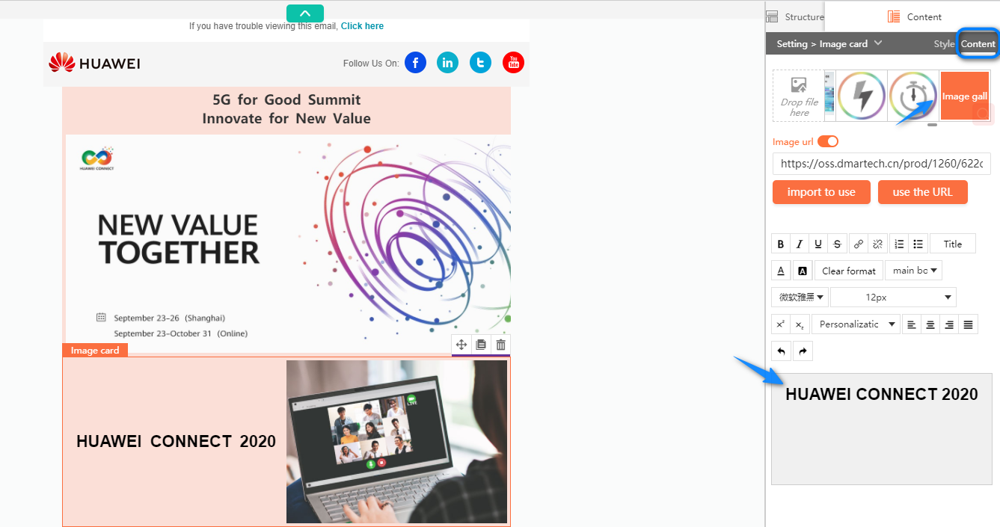

Parameter Description of Button Content 

* **URL**: The hyperlink of the button. 
* **Size**: Set button height and width, or set adaptive width.
* **Alignment**: left, center, right. Button text: The text displayed in the button, such as click here. 
* **Button Font Size**: Be careful not to exceed the button border. Font: Button text font_。_
* **Styles**: Bold, underline, italic. 
* **Button Title**: The text that will be displayed when the mouse hover on the button. Text color: Set the text color. 
* **Text spacing**: Inner spacing. 
* **Button color**: Set the button color. 
* **Border**: Button border. 
* **Border radius**: Button border can be set to rounded corners, and the number is the angle size. 
* **Margins**: Set the margins between the button and other contents.

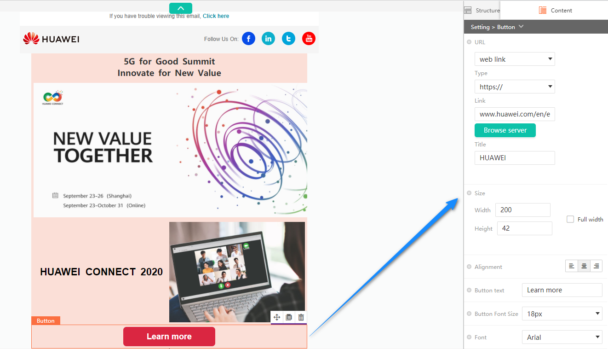

Parameter Description of Divider Content 

The Divider content is used to separate content, which can make the content of the mail more clear. 

* **Border**: Set the color and style of the divider border. 
* **Width**: Custom or adaptive. 
* **Alignment**: left, center, right. 
* **Margins**: Set the margins of the divider between the divider and other contents.

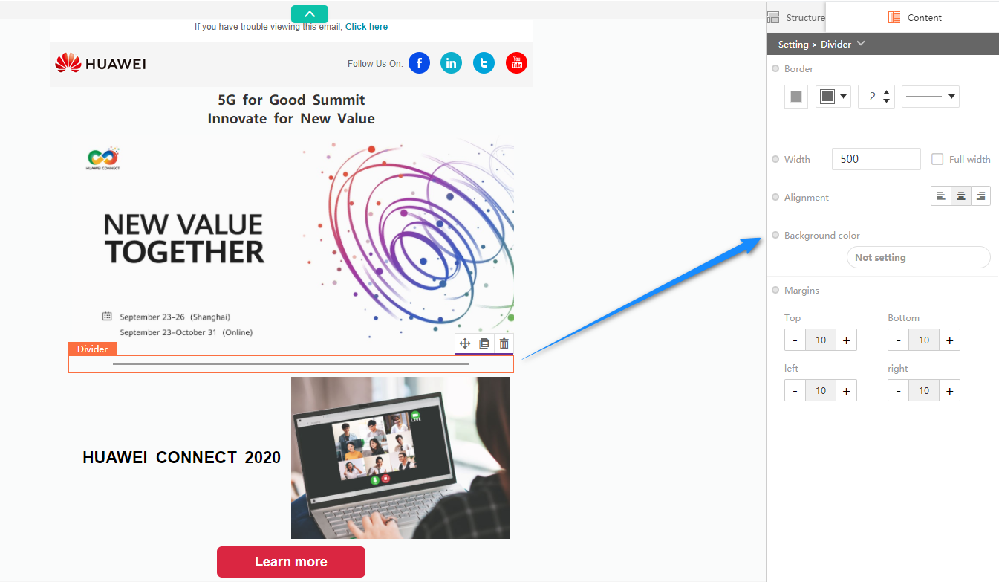

Parameter Description of Menu Content 

The Menu content setting includes Content edit, Menu style and Item style, which need to set one by one. 

Content edit: Set the name, Link and Title of each catalog item.

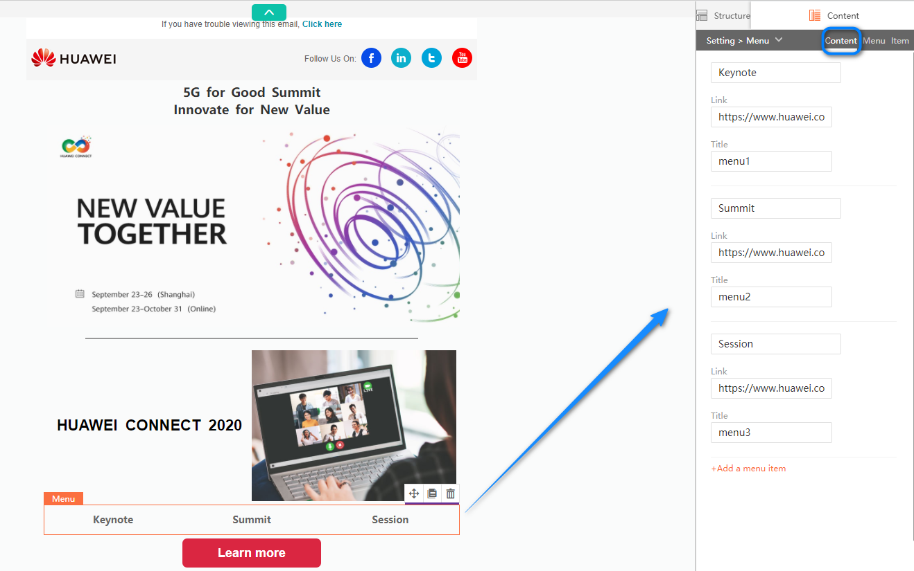

Menu style: 

* **Menu size**: Support custom width, height or use self-adaptive width. 
* **Background color**: The background color of the entire menu. 
* **Margins**: Set the margins between the menu and other contents. 

Item style: 

* **Width**: Set the width according to the number of items and the length of each text, and the width can be adaptive. 
* **Alignment**: The overall alignment of all items. 
* **Font**: The text font in each item. 
* **Styles**: Bold, underline, italic. 
* **Font size** 
* **Text color** 
* **Background color**: Item background color. 
* **Border**: The border of each item. 
* **Border radius**: Set rounded corners of the border. 
* **Padding**: The paddings between the content and the block border. 
* **Margins**: Set the margins between the menu and other contents.

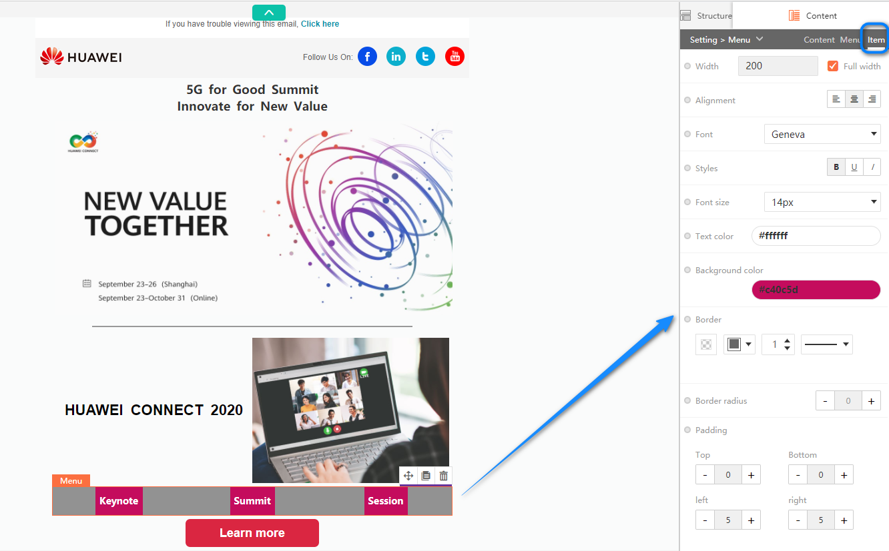

**Step 7** Repeat the above steps \(drag the block, set block, drag the content, set content\) to complete the email creation step by step. 

**Step 8** Click “Preview" or "Send test" at the top right corner after completing creation. Before that please make sure that the email label has been set. During previewing or testing, please pay attention to check whether the email format and content are correct, whether all links are clickable, and try to test how the mail displayed in different clients because different clients display may be different. For more details, please refer to Notes on Using Mail Editor.

 **Step 9** After confirming that the email content is ok, you can click "Export HTML"to export the html file of the email, which can be used for other systems or secondary development. 

**Step 10** Click **Save and Exit**.

Method 2: Create an email by using template 

**Step 1** If you don’t know how to create an exquisite email, you can select an email template with a suitable subject from the template library. Enter the template library, Dmartech presets templates for different themes, and you can directly choose to apply them.

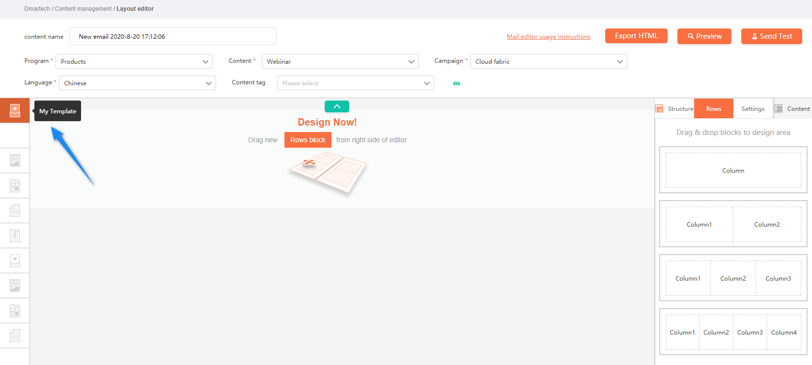

**Step 2** Click "Preview" to view the email template. Click Use to directly apply the template to the editor. 

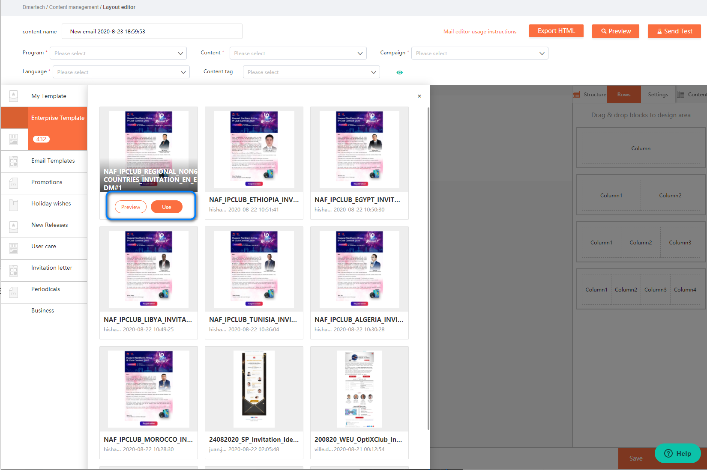

**Step 3** Click on any content in the email to modify and edit your own content. Other operations are the same as the way to create an email manually above.

