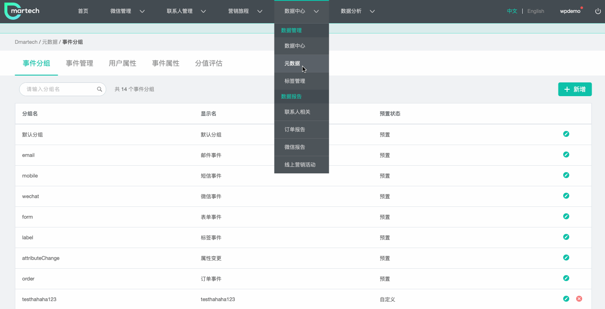
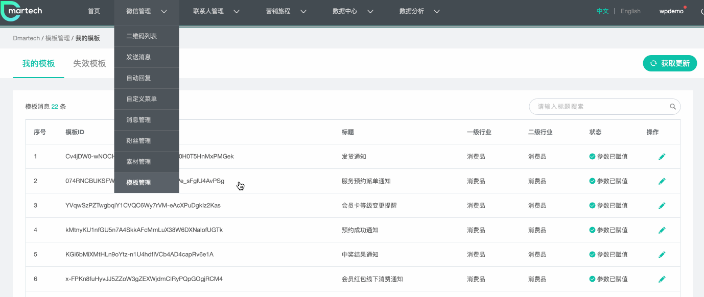

# 表单

表单可以直接下发给用户也可以部署在网站等页面收集联系人信息，Dmartech平台有两类表单，一类是使用平台的编辑器直接创建的表单，成为“标准表单“；一类是金数据表单，通过对接金数据账号接入在金数据创建的表单，称为“金数据表单“。

## 表单管理

依次点击进入“营销旅程“—表单，进入素材管理页面。

支持对素材分组管理，左侧是分组栏，右侧是素材列表，系统内置了三个分组：全部素材、我创建的、共享给我的

* 全部表单：当前所有的表单，包括系统表单、金数据表单
* 我创建的：使用账号下创建的素材
* 共享给我的：表单是可以共享的，后续会详细介绍，其他账号共享过来的表单都在该分组中

除了系统内置的分组之外，用户可以按需自行创建分组，方便表单过多时的管理。右侧表单列表分别按照全部表单、Dmartech表单、金数据表单分类。

## 标准表单

1、为了让用户提交的表单字段值能正确收集到Dmartech，在创建表单\(标准表单和金数据表单都一样\)之前，需要先在元数据（“数据中心“—“元数据“—用户属性）中创建表单将用到的字段，如果是已有的用户属性则无需创建，若是没有的，则需要新增。

2、点击表单列表页面右上角“创建表单“按钮，可以看到Dmartech提供了两种表单创建方式：标准表单和接入金数据表单。在表单列表的“表单来源列“会显示表单的类型。选择表单分组后，点击“标准表单“则进入表单编辑器。

3、单编辑器为左中右布局，左侧为字段选择区，中间为表单展示区，右侧为字段设置区。

1）在表单上方编辑表单名称和HTML名称（指导出的HTML文件的名称）

 2）在左侧字段选择区选择所需的字段或字段类型，点击即可添加至表单；

 3）点击表单中字段，在右侧设置相关字段属性，包括字段名称、HTML名称（指在HTML代码中显示的名称）、默认值、提示以及校验等，不同字段可设置校验内容不同，一般包括设置必填项、不能与已有字段重复、字符限制等。

 4）表单创建完成后，点击保存，页面跳转至“字段匹配”页面，**此时在表单右上角会出现表单链接（可复制）、表单二维码（扫描可预览表单），以及导出HTML按钮，点击可导出当前表单HTML源代码，可用于表单二次加工。**

5）保存后页面将跳转至“字段匹配”阶段，将表单中创建的字段与元数据中创建的与之对应的字段进行关联，保证正确的收集信息。

6）点击“完成”则创建成功。

 7）表单创建完成，还可以进行表单相关其他设置。

#### 其他设置

**A：扩展属性**

扩展属性一般用于区分表单数据来源，通过为表达链接添加一个扩展属性字段，由该字段判断表单数据的来源渠道。最多可设置三层扩展属性。

**B：跳转设置**

用于设置用户提交表单后页面的指向。支持三种跳转方式：默认跳转、规则设置、隐藏字段跳转。

 a\)默认跳转是指，所有的用户提交表单后都跳转至默认跳转中设置的内容页面。支持设置默认提交成功、文本、富文本、链接。

b）规则设置是指，根据用户表单中填写的某字段值跳转至不同的页面，操作为选择字段、字段值，设置对应的跳转链接。以及字段未匹配时的跳转链接。

c）隐藏字段跳转是指，表单代码中新增了一个隐藏字段【GOTOURL】，由前端开发人员在html代码中写入跳转链接，适用于需二次开发的表单。

8）以上内容都设置完毕后，表单就可以投放使用了。表单投放后，在操作栏点击“表单统计”图标，可以查看表单收集到的全部数据。

点击右上角“报告发送设置”可按照规则将报告发送到指定的邮箱内

a\)规则名称：可设置多个报告发送规则，因此每个规则需设置一个名称 

b\)字段筛选：设置字段筛选条件，报告将包含符合筛选条件的字段数据 

c\)添加筛选条件：仅符合筛选条件的数据才会导出到CSV报告内 

d\)发送时间：可设置立即发送、定时发送和周期发送 

e\)接收邮箱：添加接收报告的邮箱

## 表单的下发与使用

Dmartech下发表单有两种方式：二维码下发和模板消息下发

【二维码下发】

创建二维码时设置扫码回复表单，当用户扫描二维码就会收到表单或回复文字（点击文字链接进入表单），用户填写表单提交后，数据会自动进入Dmartech。

_**注：二维码绑定表单下发后，不能转发，因为表单链接携带参数，转发无效。**_

【模板消息下发】

在模板消息中设置跳转表单，当用户收到模板消息后，点击模板消息就可以跳转

## 表单其他基本操作

表单操作：编辑、表单统计、暂停、共享

* 编辑：已下发的表单，编辑后，只有保留的原来的字段值会被收集到，其他字段不会被收集；
* 表单统计：查看表单提交详情，统计表单提交人数与提交次数
* 暂停：暂停后提交的表单数据将不会被收集
* 共享：表单可以共享给其他账户或安全组（关于安全组的详细内容请查看“[企业设置](../ge-ren-zhong-xin/qi-ye-she-zhi.md)“），并可限制对共享表单的操作权限。

